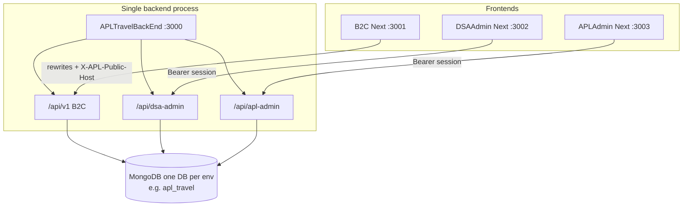
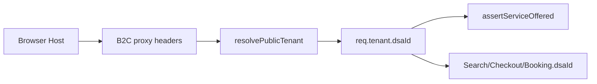
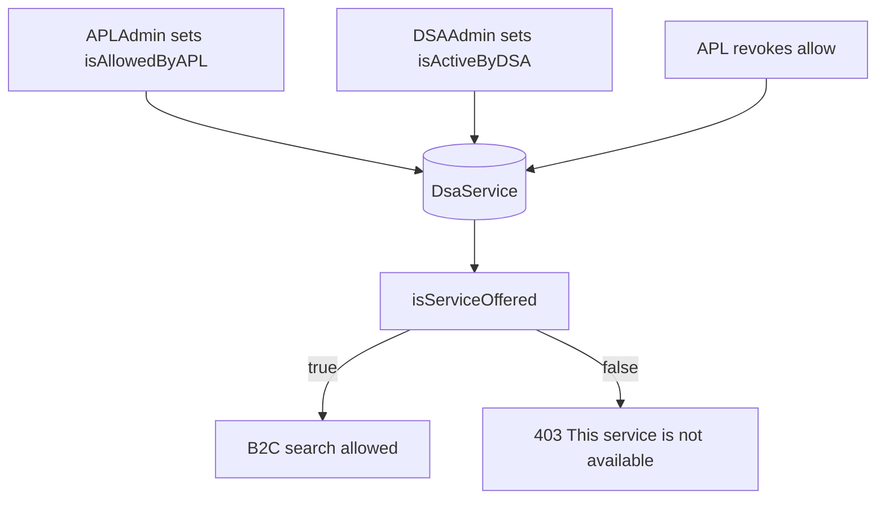
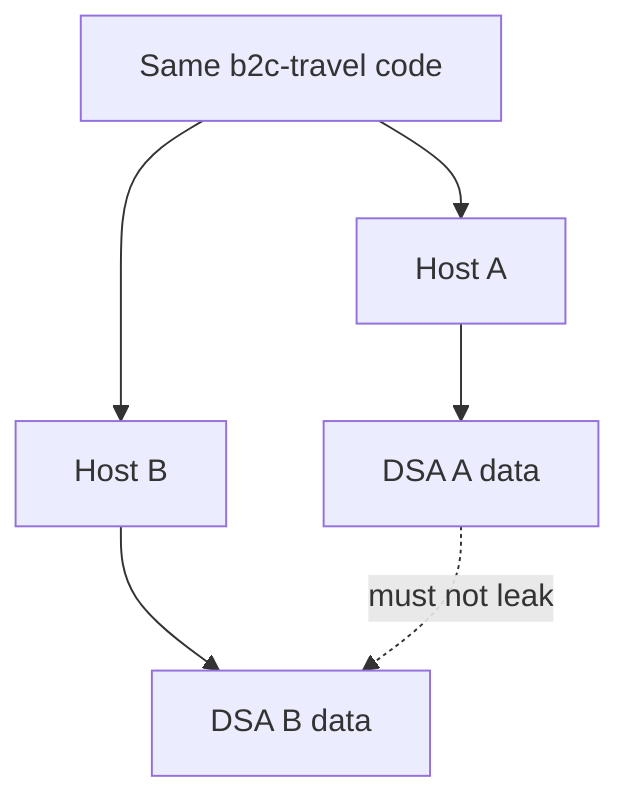
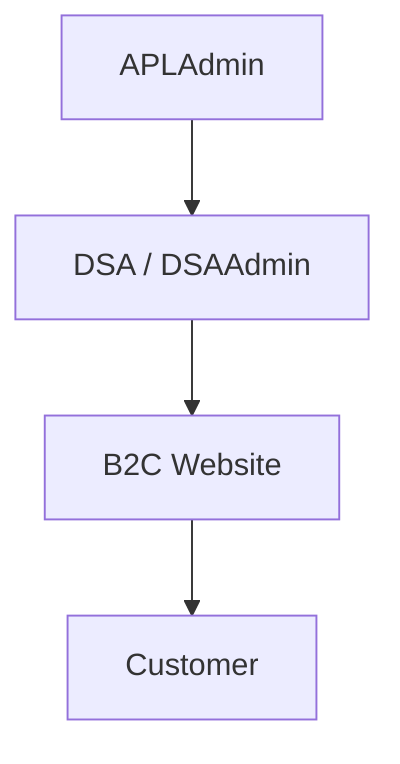
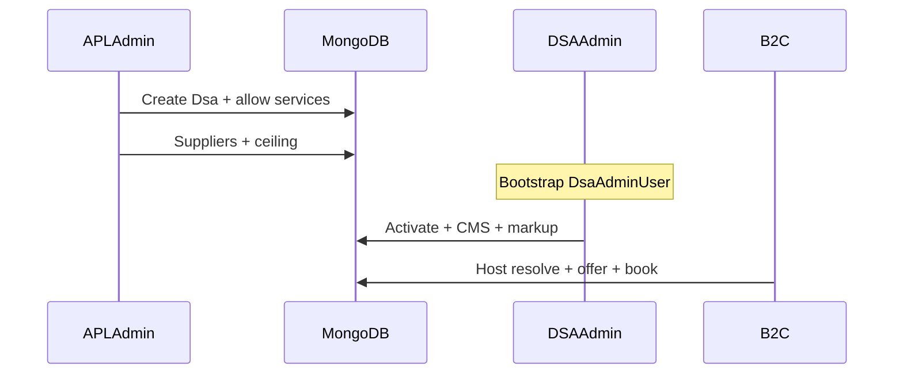
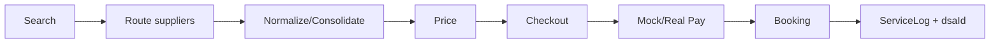

# APL Travel Platform — Current State Handoff

**Audience:** engineers / ChatGPT continuing APL Travel work  
**Generated:** 2026-10-06  
**Source priority:** current code → env/config → tests → docs  
**Last validated:** Phase 15E DSAAdminBackEnd separation (2026-10-06). See `docs/SIX_CODEBASE_ARCHITECTURE.md`, `docs/CODEBASE_SEPARATION_MAP.md`, `docs/SHARED_DOMAIN_CONTRACT.md`.

---

## 0. One-sentence summary

APL Travel is a multi-tenant OTA platform: **one shared B2C Next.js app** + **one Express backend** (logically split into B2C / DSAAdmin / APLAdmin API namespaces) + **one MongoDB per environment**, with APLAdmin controlling DSAs, DSAAdmin controlling one DSA’s website/services, and B2C resolving the DSA from **host** (never from client `dsaId`). Phase 15D adds private `@apl/shared-domain` (`packages/shared-domain`) so future separate backends share one schema/enum/offer contract before physical extraction.

---

## 1. Business hierarchy (current)

```
APL / Platform
      ↓
APLAdmin          ← platform authority
      ↓
DSA / Client      ← company tenant (Dsa)
      ↓
DSAAdmin          ← admins bound to ONE dsaId
      ↓
DSA’s B2C Website ← same B2C codebase, tenant via host
      ↓
Customer
```

| Role | Authority |
|------|-----------|
| **APLAdmin** | Create/suspend DSAs; allow/revoke services; suppliers; ceilings; all bookings/logs |
| **DSAAdmin** | Activate allowed services; CMS/branding; own markup ≤ ceiling; own bookings |
| **B2C** | Customer travel + public CMS; no admin mutations |

DSAAdmin **cannot** set `isAllowedByAPL`. APL revoke wins over DSA activation.

---

## 2. Technical architecture (CURRENT)



**CURRENT backend separation:** logical modules in **one repo / one Node process**. Physical split is **PLANNED** (`docs/ADMIN_BACKEND_ARCHITECTURE.md`) — **not implemented**.

---

## 3. Repositories & ports

| Component | Local path | Git remote | Branch | Status |
|-----------|------------|------------|--------|--------|
| B2C Frontend | `travelweb/b2c-travel` | `ROHANKUMARDALAL/APL-Travel` | `main` | Active |
| B2C Backend | `APLTravelBackEnd` (`/api/v1`) | `ROHANKUMARDALAL/APLTravelBackEnd` | `main` | Active — **shared process** |
| DSAAdmin Frontend | `DSAAdmin` | `ROHANKUMARDALAL/DSAAminFrontCode` (private) | `main` | Active |
| DSAAdmin Backend | `APLTravelBackEnd` (`/api/dsa-admin`) | same backend repo | `main` | Logical only — **not separate repo** |
| APLAdmin Frontend | `APLAdmin` | `ROHANKUMARDALAL/APLAdminFrontCode` (private) | `main` | Active |
| APLAdmin Backend | `APLTravelBackEnd` (`/api/apl-admin`) | same backend repo | `main` | Logical only — **not separate repo** |

| Process | Port (actual) |
|---------|----------------|
| Backend | **3000** (`PORT`, default) |
| B2C FE | **3001** |
| DSAAdmin FE | **3002** |
| APLAdmin FE | **3003** |

Proposed future admin backend ports **3012 / 3013** — documented only, not running.

---

## 4. Database (ACTUAL)

- **Driver:** Mongoose via `src/common/database/connection.js`
- **Config:** `MONGODB_URI` (required) — local example `mongodb://127.0.0.1:27017/apl_travel`
- **Rule in force:** **one MongoDB database per environment** for B2C + DSAAdmin + APLAdmin
- **No** separate `b2c_db` / `dsaadmin_db` / `apladmin_db`

### Important collections / models

| Model | Purpose | Main mutator | Tenant-scoped | Key |
|-------|---------|--------------|---------------|-----|
| `Dsa` | Client/tenant company | APLAdmin | N/A (is tenant) | `_id`, `dsaCode`, `domain`, `subdomain`, `status` |
| `Service` | Master catalogue (flight/hotel/bus/transfer…) | APLAdmin | NO | `code`, `globalStatus` |
| `DsaService` | APL allow + DSA activate | APL + DSA | YES | `dsaId`, `serviceId`, `isAllowedByAPL`, `isActiveByDSA` |
| `Counter` | DSA code sequence | Platform | NO | — |
| `Supplier` | Supplier catalogue | APLAdmin | NO | `code`, env, `credentialRef` |
| `SupplierService` | Supplier↔service enablement | APLAdmin | NO | `supplierId`, `serviceId` |
| `DsaSupplier` | DSA supplier assignment + priority | APLAdmin | YES | `dsaId`, `supplierId`, priority |
| `SupplierMapping` | Entity ID maps (APL↔supplier) | Adapters/ops | often via search | `supplierCode`, `aplEntityId` |
| `PricingRule` | APL markup / ceiling / DSA markup / fees | APL + DSA | DSA rules YES | `ruleKind`, `dsaId?` |
| `User` | B2C customer | B2C | **NO `dsaId` field today** | email unique **globally** |
| `LoginSession` | Customer sessions | B2C | NO | userId |
| `SavedTraveller` | Travellers | B2C | via user | userId |
| `Search` | Cached search | B2C | YES | `dsaId` |
| `CheckoutSession` | Checkout state | B2C | YES | `dsaId` |
| `Booking` | Bookings | B2C (+ ops) | YES | `dsaId`, `aplBookingRef` |
| `Payment` / `Refund` / `CancellationRequest` | Money ops | B2C/ops | YES (via booking/dsa) | refs + `dsaId` where stored |
| `WebsiteSettings`, `Banner`, `Blog`, `Testimonial`, `FooterLink`, `CmsPage` | DSA website CMS | DSAAdmin | YES | `dsaId` |
| `AplAdminUser` / `AplAdminSession` | Platform admin auth | APLAdmin | NO | — |
| `DsaAdminUser` / `DsaAdminSession` | Tenant admin auth | DSAAdmin | YES | `dsaId` on user |
| `AdminRole` | RBAC role defs | seed/platform | NO | permissions[] |
| `ServiceLog` | Request lifecycle | all writers | often YES | `requestId`, `dsaId` |
| `SupplierRawPayload` | Supplier IO audit | adapters | often YES | `requestId` |
| `Hotel` | Hotel entity/offers cache model | hotel pipeline | search-related | — |

---

## 5. Multi-tenant B2C (SAME CODEBASE)

**Intent:** one B2C app serves many DSAs via domain/branding/services/pricing — **not** one codebase per DSA.

**How much works today:**

| Capability | Status |
|------------|--------|
| Shared B2C codebase | **YES** (`b2c-travel`) |
| Host → DSA resolution | **YES** (`resolvePublicTenant`) |
| Dev host map | **YES** `PUBLIC_DEV_HOST_MAP` (ignored in production) |
| Custom `Dsa.domain` | **YES** (code path exists) |
| `{subdomain}.{PUBLIC_TENANT_BASE_DOMAIN}` | **YES** if base domain env set; local often empty |
| Per-DSA WebsiteSettings / CMS | **YES** |
| Per-DSA effective services | **YES** (`isServiceOffered`) |
| Per-DSA pricing rules | **YES** |
| Per-DSA supplier assignments | **YES** (`DsaSupplier`; else dev legacy mock fan-out) |
| Per-DSA bookings on Search/Checkout/Booking | **YES** (`dsaId`) |
| Per-DSA customer `User.dsaId` | **NO** — users are global by email |
| Production multi-domain live proof | **PARTIAL** — code ready; ops/DNS/`PUBLIC_TENANT_BASE_DOMAIN` must be configured |

Local default mapping (from backend `.env`):

`localhost:3001` / `127.0.0.1:3001` → `APL-DSA-0034`

B2C `proxy.js` sets `X-APL-Public-Host` + `X-Forwarded-Host` from browser Host so backend can resolve tenant when API is rewritten to `:3000`.

---

## 6. URL / domain / token model

| Surface | How DSA is chosen | Token/session |
|---------|-------------------|---------------|
| **B2C public + travel APIs** | Host → `resolvePublicTenant` → `req.tenant.dsaId` | Customer Bearer/`LoginSession` (identity only; **not** tenant authority) |
| **DSAAdmin** | `DsaAdminUser.dsaId` loaded into session at login | Opaque Bearer → `DsaAdminSession` |
| **APLAdmin** | N/A (platform) | Opaque Bearer → `AplAdminSession` |

**Never trusted:** body/query `dsaId`, `x-dsa-id` (stripped in `stripClientTenantSelectors`).



---

## 7. Zero → end business flow (“Demo Travel” example)

Illustrative — **not created** by this documentation task.

| Step | Portal | Action | DB effect | Result |
|------|--------|--------|-----------|--------|
| 1 | APLAdmin | Login Super Admin | session | Authenticated |
| 2 | APLAdmin | Create DSA “Demo Travel” | `Dsa` + `dsaCode` via Counter | Tenant exists |
| 3 | APLAdmin | Allow Flight/Hotel/Bus; deny Transfer | `DsaService.isAllowedByAPL` | DSA sees permissions |
| 4 | APLAdmin | Domain/subdomain, suppliers, ceiling | `Dsa`, `DsaSupplier`, `PricingRule` | Parent controls set |
| 5–6 | Bootstrap/CLI or ops | Create `DsaAdminUser` for that `dsaId` | admin user | DSA can log in |
| 7 | DSAAdmin | Login | session with `dsaId` | Isolated to Demo Travel |
| 8 | DSAAdmin | Activate Flight/Hotel/Bus; cannot activate Transfer | `isActiveByDSA` | Transfer stays blocked |
| 9 | DSAAdmin | Branding/CMS/markup | CMS + `PricingRule` DSA | Website config |
| 10 | B2C | Customer opens Demo host | resolver → dsaId | Correct brand/services |
| 11 | B2C | Search… | Search.dsaId + routing + pricing | Offers |
| 12 | Checkout/Pay/Book | | Checkout/Payment/Booking.dsaId | Booking owned by DSA |
| 13 | APL revoke Flight | `isAllowedByAPL=false` | DSA cannot override; B2C + API deny | **Implemented** (`isServiceOffered` + `requireOfferedService`; hierarchy test + live revoke → `403`) |

---

## 8. Component deep-dives

### 8.1 B2C Frontend

| | |
|--|--|
| Path | `travelweb/b2c-travel` |
| Framework | Next.js 16 (App Router), React |
| Port | 3001 |
| Purpose | Shared customer portal for any DSA |

**Main areas:** `app/` (flights, hotels, buses, transfers, checkout, my-trips, blogs, pages, login/signup, account), `lib/api`, `lib/site`, `components/`, `proxy.js`

**API strategy:** Next rewrites  
- `/api/v1/public/*` + `/media/*` → `PUBLIC_SITE_ORIGIN` or `BACKEND_ORIGIN`  
- `/api/v1/*` → `BACKEND_ORIGIN`  
Default example points to Render; **current local `.env.local`:** `http://127.0.0.1:3000`

**Tenant config:** `lib/site/config.js` fetches `/api/v1/public/site/config` with `X-APL-Public-Host`; services from backend offer list (fail-closed).

**Status:** REAL UI against backend mocks for suppliers/payments; CMS/branding REAL when backend/tenant configured.

### 8.2 B2C Backend (`/api/v1`)

| | |
|--|--|
| Path | `APLTravelBackEnd` |
| Port | 3000 |
| Modules | `flight`, `hotel`, `bus`, `transfer`, `user`, `booking`, `public-site`, `payments` (customer), `suppliers`, `pricing`, `tenant`, `cms` (read) |

**Important API groups (not exhaustive):**

- `POST /api/v1/{flights|hotels|buses|transfers}/search` (+ revalidate/book flows)
- ` /api/v1/auth`, `/account`, `/travellers`, `/bookings`
- `GET /api/v1/public/site/config`, blogs, pages
- `/health`, `/ready` (liveness vs dependency readiness)
- `/media/*` local uploads

**Pipeline:** tenant middleware → offer check → supplier plan → adapter search → normalize/consolidate → price → sanitize public payload → persist Search with `dsaId`.

### 8.3 DSAAdmin Frontend

| | |
|--|--|
| Path / remote | `DSAAdmin` → `DSAAminFrontCode` |
| Framework | Next.js + Tailwind |
| Port | 3002 |
| API | `NEXT_PUBLIC_API_ORIGIN` → `/api/dsa-admin` (local: `:3000`) |

| Page | Backend? | Notes |
|------|----------|-------|
| Login | YES | Password eye |
| Dashboard / Services / Bookings / Pricing | YES | Services show APL allow / DSA active / On B2C |
| Branding / Blogs / Testimonials / Footer / CMS | YES | CMS APIs |
| Settings | YES | Profile/domain fields |
| Users | **PARTIAL** | Shows current admin only — no team CRUD API UI |

### 8.4 DSAAdmin Backend (`/api/dsa-admin`)

**Not a separate process.** Code: `src/dsa-admin`, `src/cms` (mutate), shared tenant/pricing/ops.

**Auth:** login → opaque token → `DsaAdminSession`; `requireDsaAdmin` + `requirePermission`; **`dsaId` only from session user**.

**Isolation:** all queries scoped to `session.dsaId`; cannot patch another DSA’s CMS/services/bookings.

**Capabilities:** profile, services activate, CMS CRUD, markup ≤ ceiling, own bookings list/detail.

### 8.5 APLAdmin Frontend

| | |
|--|--|
| Path / remote | `APLAdmin` → `APLAdminFrontCode` |
| Port | 3003 |
| API | `NEXT_PUBLIC_API_ORIGIN` → `/api/apl-admin` |

| Module | Status |
|--------|--------|
| Login, Dashboard, DSAs, DSA detail (overview/services) | LIVE |
| Services, DSA service mapping, Suppliers (+ assignments), Pricing | LIVE |
| Bookings, Payments & Refunds, Request Logs | LIVE |
| Users / Audit Logs / Settings | **PLACEHOLDER** (`ModulePlaceholder`) |
| DSA detail Admins tab | **LIVE** (provision via APLAdmin) |
| DSA detail Activity tab | **PLACEHOLDER** |

### 8.6 APLAdmin Backend (`/api/apl-admin`)

**Not a separate process.** Code: `src/apl-admin` + shared catalog/pricing/suppliers/ops.

**Parent authority:** only APL can create DSAs, set `isAllowedByAPL`, manage suppliers/credentials refs, platform pricing/ceilings, view all-tenant ops data.

---

## 9. Service control matrix

| Condition | Field |
|-----------|--------|
| Global Active | `Service.globalStatus === 'ACTIVE'` |
| Allowed by APL | `DsaService.isAllowedByAPL === true` |
| Active by DSA | `DsaService.isActiveByDSA === true` |
| DSA Active | `Dsa.status === 'ACTIVE'` |

**Effective on B2C** = all of the above.

**Code:** `src/tenant/services/service-offer.service.js` → `isServiceOffered` / `evaluateServiceOffer`  
**Enforcement:** `requireOfferedService(serviceCode)` on transactional routes (frontend hide ≠ authorization).



---

## 10. Supplier architecture

**Models:** `Supplier`, `SupplierService`, `DsaSupplier` (+ legacy `SupplierMapping` for entity IDs)  
**Routing:** `src/suppliers/services/supplier-routing.service.js`  
- Uses DSA assignments + priority when present  
- **Dev fallback:** `LEGACY_MOCK_FANOUT` if no `DsaSupplier` rows  
- **Production:** does not fail-open past DSA restrictions  
**Runtime:** `src/suppliers/runtime` (HTTP client, credential resolver via `credentialRef` / env) — Phase **11A** ready; **11B LIVE Flight blocked**

| Service | Adapters today | Status |
|---------|----------------|--------|
| Flight | Mock TBO / TRIPJACK / KAFILA | **MOCK** (registry ready for real adapters) |
| Hotel | Mock TBO / TRIPJACK / KAFILA | **MOCK** |
| Bus | MOCKBUS_A / MOCKBUS_B | **MOCK** foundation |
| Transfer | MOCKXFER_A / MOCKXFER_B | **MOCK** foundation |

**Phase 11B BLOCKED** until real Flight supplier docs + TEST credentials.

---

## 11. Pricing

```
Supplier price
  → APL_MARKUP (+ optional SERVICE_FEE / discounts)
  → DSA_MARKUP (blocked/clamped by DSA_MARKUP_CEILING)
  → customer final price
```

- Engine: `src/pricing/services/pricing-engine.service.js`  
- Rules: `PricingRule`  
- Internal `commercialSnapshot` stored for booking integrity; **stripped from public search responses** (flight/hotel/bus/transfer sanitizers)  
- DSAAdmin sees ceiling + own markup; not designed to expose full APL margin breakdown to B2C  
- Tamper: revalidate/checkout recompute; snapshot on booking path

---

## 12. Payment / booking / refund

```
search → revalidate → checkout → payment → book → cancel → refund
```

| Piece | Status |
|-------|--------|
| Payment provider | **MOCK** `APL_MOCK_PAY` (blocked in production) |
| Idempotency | **YES** on payment keys; replay flags in tests |
| Pay OK / book fail | **YES** → `CheckoutSession` `PAYMENT_CAPTURED_BOOKING_FAILED`, `needsAttention` |
| Cancel/refund | Implemented with mock refund provider path |

---

## 13. Logging / observability

- `requestId` middleware on requests  
- `ServiceLog` stages include inbound / supplier / normalized / payment / `BOOKING_FAILED` etc.  
- `SupplierRawPayload` for supplier IO (size/TTL capped)  
- APLAdmin **Request Logs** UI reads these via `/api/apl-admin/request-logs`  
- `/health` = liveness; `/ready` = Mongo + bootstrap flags  

---

## 14. Authentication

| Portal | Mechanism | Tenant bind |
|--------|-----------|-------------|
| B2C customer | email/password + `LoginSession` | **Host** for transactions; User has no `dsaId` |
| DSAAdmin | email/password + opaque token + `DsaAdminSession` | `DsaAdminUser.dsaId` |
| APLAdmin | email/password + opaque token + `AplAdminSession` | platform |

RBAC: `AdminRole` + `requirePermission` (shared permission codes).

### Dev test credentials (DEVELOPMENT ONLY)

| Portal | Email | Password | Verified |
|--------|-------|----------|----------|
| APLAdmin | `admin@apltravel.local` | `AplAdmin123!` | **VERIFIED** (`POST /api/apl-admin/auth/login`) |
| DSAAdmin | `owner@dsa.local` | `DsaAdmin123!` | **VERIFIED** (`POST /api/dsa-admin/auth/login`) |

Bootstrap scripts: `scripts/bootstrap-apl-admin.js`, `scripts/bootstrap-dsa-admin.js` (env vars; do not commit secrets).

---

## 15. Environment flow

### Local development (current machines)

| App | Points to |
|-----|-----------|
| Backend | Local Mongo `apl_travel` |
| DSAAdmin / APLAdmin `.env.local` | `http://localhost:3000` |
| B2C `.env.local` | `BACKEND_ORIGIN=http://127.0.0.1:3000` (local cycle) |

### Deployed / Render (from config comments + B2C defaults)

| App | Typical |
|-----|---------|
| Backend | Render `apltravelbackend.onrender.com` + Atlas `MONGODB_URI` |
| B2C default rewrite | Render backend if `BACKEND_ORIGIN` unset |
| Admin apps | Documented to use localhost for admin work; B2C often kept on Render/Atlas separately |

**Caution:** local Mongo ≠ Atlas unless URIs match — admins on local + B2C on Render = **different data**.

---

## 16. What is complete (by theme)

| Theme | Done |
|-------|------|
| Foundation | Express app, envelopes, errors, readiness probes |
| Multi-tenancy | Dsa, host resolver, transaction tenant, offer rule |
| Admin | APL + DSA auth/RBAC, core CRUD UIs |
| CMS | Full DSA CMS + public delivery |
| Transactions | Search→checkout→pay→book with `dsaId` |
| Suppliers | Platform models + routing + mock adapters + 11A runtime |
| Pricing | Rules engine + ceiling + snapshots |
| Payments | Mock pay/refund + needsAttention path |
| Services | Flight/Hotel/Bus/Transfer **mock** stacks |
| Ops/Hardening | ServiceLog, request logs UI, 15A readiness, 15B UI/docs |

Phases (tracker): **1–10 ✅ · 11A ✅ · 11B ⏸ · 12–15A ✅ · 15B design/UI/repos ✅ · backend physical split not started · 16 not started**

---

## 17. What is MOCK

- Flight suppliers (TBO/Tripjack/Kafila adapters)  
- Hotel suppliers (same)  
- Bus suppliers (MOCKBUS_*)  
- Transfer suppliers (MOCKXFER_*)  
- Payment provider `APL_MOCK_PAY`  

---

## 18. What is BLOCKED (external)

- **Phase 11B:** real Flight supplier API docs + TEST credentials (+ then LIVE wiring)

---

## 19. What is PARTIAL / NOT DONE

1. Physical separate DSAAdmin/APLAdmin backend repos/processes  
2. Real supplier integrations (all verticals)  
3. Real payment gateway  
4. Production object storage (media is local disk `/media`)  
5. Production multi-domain ops (`PUBLIC_TENANT_BASE_DOMAIN`, DNS, SSL) often unset locally  
6. APLAdmin Users / Audit / Settings UIs (placeholders)  
7. DSAAdmin multi-user team management beyond first provision (list/create via APLAdmin now works; disable/reset UX incomplete)  
8. B2C `User` not tenant-scoped (global email) — recommend GLOBAL+MEMBERSHIP later; bookings already tenanted  
9. Historical booking migration / legacy rows without `dsaId` (fail-closed on tenant routes)  
10. Shared npm domain package for future multi-backend (designed, not extracted)  
11. Phase 15C proven: new DSA onboarding + admin provision + two-host isolation + revoke/suspend

---

## 20. Security model (current)

- Trusted `dsaId`: host resolver (B2C) or admin session (DSAAdmin)  
- Strip client tenant selectors  
- RBAC on admin routes  
- Service authorization via offer rule server-side  
- Pricing snapshot + public strip of `commercialSnapshot` / `supplierPrice`  
- Supplier secrets via env/`credentialRef` — not returned to B2C/DSAAdmin UIs  
- Redaction helpers on logs  
- Cross-DSA booking lists scoped; cross-customer via auth + booking ownership checks  
- Mock payments refused when `NODE_ENV=production`

---

## 21. Zero-to-end manual test plan (new DSA)

Execute later; do not invent data here.

| # | Portal | Action | Expected DB | Expected result |
|---|--------|--------|-------------|-----------------|
| 1 | APLAdmin | Login | session | OK |
| 2 | APLAdmin | Create DSA | `Dsa` + code | New tenant |
| 3 | — | Note `dsaId`/`dsaCode` | — | Stable IDs |
| 4 | APLAdmin | Set domain/subdomain | `Dsa.domain/subdomain` | Unique indexes |
| 5 | APLAdmin | Allow services | `DsaService` allow flags | DSA sees allow |
| 6 | APLAdmin | Assign suppliers | `DsaSupplier` | Routing uses them |
| 7 | APLAdmin | Ceiling rules | `PricingRule` | Ceiling visible to DSA |
| 8 | CLI/ops | Create DSAAdmin user | `DsaAdminUser` | Login works |
| 9–11 | DSAAdmin | Login; check identity/services | session | Only allowed services |
| 12–15 | DSAAdmin | Activate; CMS; markup | CMS + rules | Persisted |
| 16–19 | B2C | Open host; brand; services; search | Search.dsaId | Correct tenant |
| 20 | APLAdmin logs | Inspect requestId | ServiceLog | dsaId present |
| 21–24 | B2C | Checkout → mock pay → book | Booking.dsaId | Confirmed |
| 25–27 | DSA / other DSA / APL | Booking visibility | filters | DSA-only vs all |
| 28–29 | B2C/ops | Cancel/refund | Payment/Refund | Status sync |
| 30–33 | APL revoke | `isAllowedByAPL=false` | mapping | DSA blocked; B2C hide; API 403 |
| 34–35 | APL suspend DSA | `Dsa.status=SUSPENDED` | — | Public forbidden / fail closed |

---

## 22. Multi-DSA isolation test

| Check | DSA A | DSA B |
|-------|-------|-------|
| B2C URL/host | host A → map/domain A | host B → map/domain B |
| Same B2C code | YES | YES |
| Branding/CMS | A only | B only |
| DSAAdmin session | userA.dsaId=A | userB.dsaId=B |
| Services/pricing | independent | independent |
| Booking list | only A | only B |
| Cross-open booking by ref on wrong host | **403 / not available** | same |
| APLAdmin | sees both | sees both |

**Critical:** never pass `dsaId` from frontend as authority.



---

## 23. Architecture diagrams (compact)

### Platform hierarchy



### Onboarding



### Search → book



---

## 24. Key file index (for navigation)

| Concern | Path |
|---------|------|
| App mounts | `src/app.js` |
| Offer rule | `src/tenant/services/service-offer.service.js` |
| Public tenant | `src/public-site/services/resolve-tenant.service.js` |
| Tx tenant | `src/tenant/middleware/require-transaction-tenant.js` |
| Supplier plan | `src/suppliers/services/supplier-routing.service.js` |
| Pricing engine | `src/pricing/services/pricing-engine.service.js` |
| Pay+book orchestration | `src/common/services/checkout-booking.service.js` |
| B2C host forward | `travelweb/b2c-travel/proxy.js` |
| Design for future split | `docs/ADMIN_BACKEND_ARCHITECTURE.md` |

---

## 25. Decision gate (do not auto-implement)

Next engineering choices (await human instruction):

- **Phase 15F** APLAdmin Backend Separation (`APLAdminBackEnd` :3005)  
- Provide Flight supplier materials for 11B  
- Customer identity: **GLOBAL USER + DSA MEMBERSHIP** (design only; implement later)  

**Do not start Phase 15F/16 automatically.**

### Phase 15E artifacts

| Artifact | Path |
|----------|------|
| Six-codebase architecture | `docs/SIX_CODEBASE_ARCHITECTURE.md` |
| Separation map | `docs/CODEBASE_SEPARATION_MAP.md` |
| DSAAdminBackEnd | `/Users/rohandalal/Developer/AplTech/DSAAdminBackEnd` (:3004) |
| Shared package | `packages/shared-domain` (+ canonical `models/Dsa|Service|DsaService`) |
| DSAAdmin FE origin | `NEXT_PUBLIC_API_ORIGIN=http://localhost:3004` |
| Legacy `/api/dsa-admin` on :3000 | ACTIVE (strangler; remove in 15G) |
